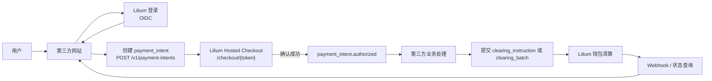
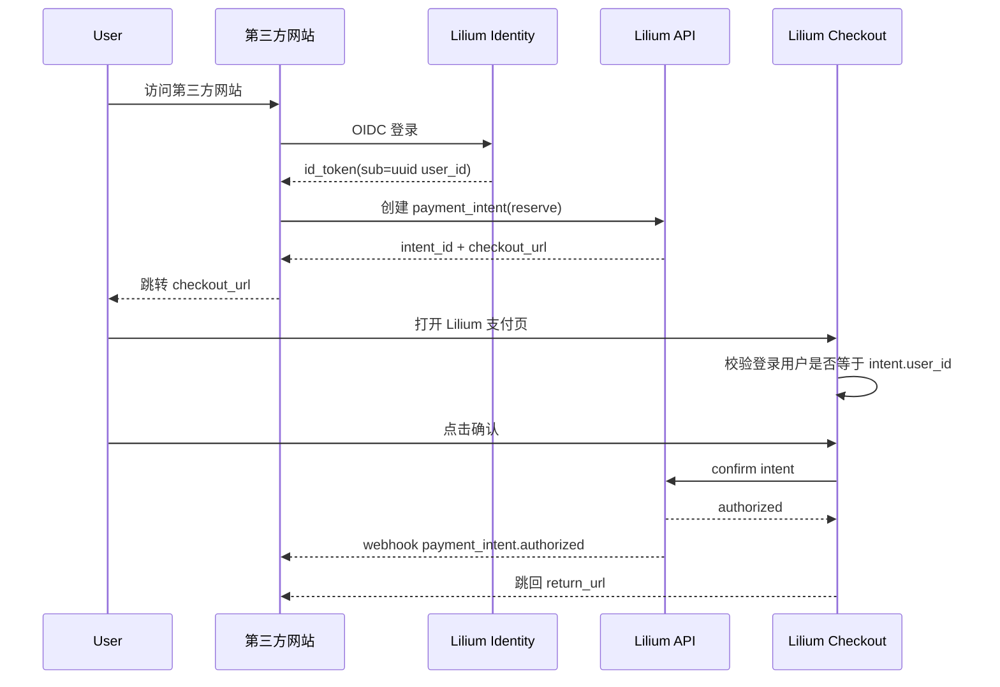
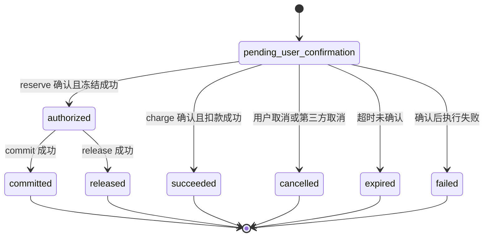
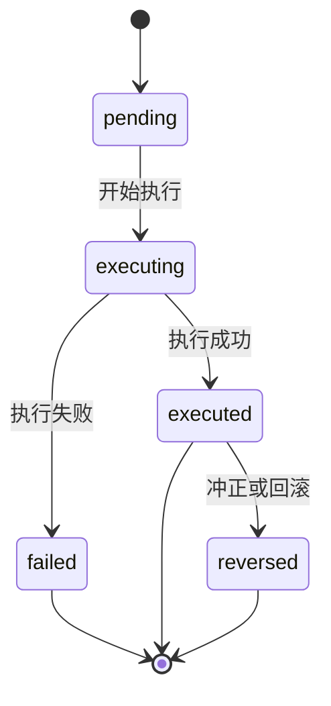
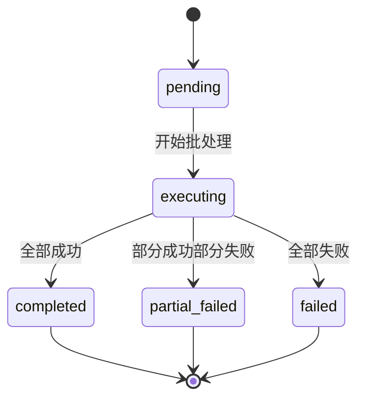

# Lilium 开放清算 API 接入规范 v1

适用对象：接入 Lilium 的第三方开发者  
文档状态：草案

## 目录

- [1. 文档说明](#overview)
- [2. 对外入口](#endpoints)
- [3. 认证与授权](#auth)
- [4. 核心对象](#objects)
- [5. 数据契约](#data-contract)
- [6. API 概览](#api-overview)
- [7. Payment Intent API](#payment-intent-api)
- [8. Clearing Instruction API](#clearing-instruction-api)
- [9. Clearing Batch API](#clearing-batch-api)
- [10. Hosted Checkout](#hosted-checkout)
- [11. 主流程](#flows)
- [12. 状态模型](#state-models)
- [13. Webhook](#webhooks)
- [14. 错误模型](#errors)
- [15. 幂等要求](#idempotency)
- [16. 安全要求](#security)
- [17. 接入清单](#checklist)
- [18. 基金场景示例](#fund-examples)
- [19. OpenAPI 契约](#openapi)

<a id="overview"></a>
## 1. 文档说明

Lilium 提供面向第三方业务系统的游戏币清算能力。第三方可以：

- 使用 Lilium 身份体系识别用户
- 创建需要用户确认的支付意图
- 将用户跳转到 Lilium Hosted Checkout 完成确认
- 在业务结果明确后提交后台清算指令
- 通过 Webhook 或查询接口获取最终状态

本规范仅适用于游戏币场景，不涉及真实货币、银行卡或受监管支付体系。

典型场景：

- 基金申购
- 基金赎回到账
- 分红发放
- 保险资金池赔付
- 交易市场或拍卖结算

Lilium 负责：

- 用户认证
- 第三方后台鉴权
- Hosted Checkout
- 余额冻结、提交、退回、发放、扣减
- 状态查询、Webhook 和审计留痕

第三方负责：

- 业务产品本身
- 金额计算
- 业务订单与业务状态
- 申购成功或失败等业务结果判定
- 在业务处理完成后调用后续清算 API

边界：

- `user_id` 是业务标识，不是直接授权凭证
- 任何会冻结或扣减用户余额的动作，都必须由用户在 Lilium 页面确认
- 第三方不得绕过 Hosted Checkout 直接发起用户扣款或冻结
- Lilium 不计算基金净值、份额、收益、亏损或持仓
- Lilium 不提供官方 SDK，仅提供 OpenAPI 契约

<a id="endpoints"></a>
## 2. 对外入口

Lilium 对外使用以下域名：

- API 域名：`https://api.lilium.kuma.homes`
- 登录与 Checkout 域名：`https://lilium.kuma.homes`

对外端点：

- `https://lilium.kuma.homes/oauth/authorize`
- `https://lilium.kuma.homes/oauth/token`
- `https://lilium.kuma.homes/.well-known/openid-configuration`
- `https://lilium.kuma.homes/.well-known/jwks.json`
- `https://api.lilium.kuma.homes/v1/payment-intents`
- `https://api.lilium.kuma.homes/v1/clearing-instructions`
- `https://api.lilium.kuma.homes/v1/clearing-batches`
- `https://lilium.kuma.homes/checkout/{checkout_token}`
- `https://api.lilium.kuma.homes/openapi.json`

<a id="auth"></a>
## 3. 认证与授权

### 3.1 第三方站点用户识别

第三方站点侧的用户识别使用 `OIDC Authorization Code + PKCE`。

第三方应接入 Lilium 提供的以下 OIDC 能力：

- authorization endpoint
- token endpoint
- userinfo endpoint
- discovery document
- JWKS endpoint

第三方应将 ID Token 中的 `sub` 视为 Lilium `user_id`。`sub` 的格式是 UUID 字符串。

### 3.2 用户信息获取

第三方登录完成后，可以通过以下两种方式获取用户信息：

1. 从 `id_token` 中直接读取用户资料字段
2. 使用 `access_token` 调用 `userinfo endpoint` 获取最新资料

Lilium 对第三方的约束如下：

- `sub` 是用户主标识，等于 Lilium `user_id`
- 第三方必须将 `sub` 作为自己的稳定外键
- `display_name`、`avatar_url` 属于可变资料，不应作为主键使用

OIDC scope：

- `openid`
- `profile`

#### `id_token` 字段

`id_token` 至少包含：

- `iss`
- `sub`
- `aud`
- `exp`
- `iat`
- `display_name`
- `avatar_url`

其中：

- `sub` 是稳定主标识
- `display_name` 与 `avatar_url` 是签发时快照，不保证实时最新

示例：

```json
{
  "iss": "https://lilium.kuma.homes",
  "sub": "550e8400-e29b-41d4-a716-446655440000",
  "aud": "partner-client-id",
  "exp": 1760000000,
  "iat": 1759996400,
  "display_name": "Kuma",
  "avatar_url": "https://lilium.kuma.homes/avatar/550e8400-e29b-41d4-a716-446655440000"
}
```

#### `userinfo` 响应

第三方可使用浏览器登录流程中拿到的 `access_token` 调用 `userinfo endpoint` 获取用户展示资料。

`userinfo` 响应至少可包含：

- `sub`
- `display_name`
- `avatar_url`

示例：

```json
{
  "sub": "550e8400-e29b-41d4-a716-446655440000",
  "display_name": "Kuma",
  "avatar_url": "https://lilium.kuma.homes/avatar/550e8400-e29b-41d4-a716-446655440000"
}
```

#### 使用规则

- `sub` 必须用于标识用户
- `id_token` 中的 `display_name`、`avatar_url` 可直接用于首次渲染
- 如果第三方需要最新资料，应调用 `userinfo endpoint`
- `display_name`、`avatar_url` 应视为可更新字段
- 第三方不应依赖 `display_name` 或 `avatar_url` 的长期稳定性

### 3.3 Checkout 登录与会话

`checkout` 页面由用户浏览器直接访问，使用 Lilium 现有前端登录机制与会话。

约束：

- `checkout` 不使用第三方机构的 HMAC 鉴权
- `checkout` 不要求第三方额外集成新的浏览器侧授权协议
- 如果用户访问 `checkout` 时未登录，Lilium 应跳转到现有前端登录流程
- 登录成功后，Lilium 应回到原始 `checkout` 页面继续支付确认
- `checkout` 页面必须基于当前登录用户校验 `intent.user_id`

### 3.4 服务端鉴权

第三方服务端调用清算相关 API 时，使用机构级 HMAC 签名。

适用范围：

- `POST /v1/payment-intents`
- `GET /v1/payment-intents/{intent_id}`
- `POST /v1/payment-intents/{intent_id}/cancel`
- `POST /v1/clearing-instructions`
- `GET /v1/clearing-instructions/{instruction_id}`
- `POST /v1/clearing-instructions/{instruction_id}/reverse`
- `POST /v1/clearing-batches`
- `GET /v1/clearing-batches/{batch_id}`
- `GET /v1/clearing-batches/{batch_id}/items`

第三方不得使用浏览器侧用户 token 调用这些 API。

第三方调用方身份由以下配置确定：

- `client_id`
- `client_secret`

### 3.5 HMAC 请求头

所有清算 API 请求都必须携带：

```http
X-Lilium-Client-Id: <client_id>
X-Lilium-Timestamp: <RFC3339 UTC timestamp>
X-Lilium-Nonce: <unique nonce>
X-Lilium-Signature: <hmac signature>
Idempotency-Key: <uuid>
Content-Type: application/json
```

### 3.6 HMAC 签名规范

签名串按以下顺序拼接，每一段之间用换行符 `\n` 连接：

```text
HTTP_METHOD
REQUEST_PATH
X-Lilium-Timestamp
X-Lilium-Nonce
SHA256(raw_body)
```

示例：

```text
POST
/v1/clearing-batches
2026-04-09T05:00:00Z
6f2d5c8e-2d6c-4b69-8d73-1f1f0c93c2aa
f3b0c44298fc1c149afbf4c8996fb924...
```

然后用 `client_secret` 计算：

```text
signature = HMAC_SHA256(client_secret, canonical_string)
```

### 3.7 时间戳与重放保护

Lilium 对清算 API 的请求做以下校验：

- `X-Lilium-Timestamp` 必须是 UTC 时间
- 请求时间与服务端当前时间的偏差不得超过 5 分钟
- `X-Lilium-Nonce` 在有效时间窗口内不得重复

签名不通过、时间戳过期或 nonce 重复时，请求应被拒绝。

<a id="objects"></a>
## 4. 核心对象

### 4.1 `user_id`

Lilium 全局用户标识，用于所有用户相关请求与响应。

### 4.2 `partner`

第三方接入机构。每个 partner 至少包含：

- `partner_id`
- `client_id`
- `client_secret`
- `allowed_scopes`
- `webhook_url`
- `webhook_secret`

### 4.3 `clearing_account`

Lilium 管理的清算对手账户。第三方只能引用该账户，不能直接操作内部钱包。

示例：

- `fund.alpha`
- `fund.beta`
- `fund.dividend_pool`
- `insurance.pool`

### 4.4 `payment_intent`

需要用户确认的一笔支付意图。适用于用户授权场景。

### 4.5 `clearing_instruction`

单笔后台清算动作。适用于已获授权后的后续处理，或无需再次用户确认的发放类动作。

### 4.6 `clearing_batch`

一批后台清算动作的提交与执行结果汇总。

### 4.7 第三方接入配置模型

每个第三方至少需要维护两类配置：

1. 接口凭证
2. 清算账户

这两类配置职责不同，不能混用。

接口凭证解决：

- 谁可以调用 API
- 可调用哪些 scope
- Webhook 如何签名和验签

清算账户解决：

- 钱最终记到哪里
- 分红、赎回、退款从哪个账户出款
- 对账时如何区分不同产品或资金池

关系模型：

- 一个 `partner` 对应一个机构
- 一个 `partner` 可以配置一个或多个 `client`
- 一个 `partner` 可以配置一个或多个 `clearing_account`

<a id="data-contract"></a>
## 5. 数据契约

除非另有说明，所有字符串字段均使用 UTF-8 编码，且不应包含前后空白。

### 5.1 字段与长度约束

| 字段 | 适用范围 | 类型 | 约束 | 说明 |
| --- | --- | --- | --- | --- |
| `user_id` | 所有用户相关请求/响应 | string | UUID，固定 36 字符 | 例如 `550e8400-e29b-41d4-a716-446655440000` |
| `partner_id` | 第三方配置 | string | 1-64 字符 | 机构标识 |
| `account_code` | `payment_intent` / `clearing_instruction` / `clearing_batch` | string | 1-64 字符 | 例如 `fund.alpha` |
| `wallet_user_id` | 清算账户配置 | string | 1-128 字符 | Lilium 内部系统钱包标识 |
| `intent_id` | `payment_intent` 响应、`clearing_instruction` 请求、`clearing_batch.items[]` | string | 1-64 字符 | Lilium 生成，例如 `pi_...` |
| `instruction_id` | `clearing_instruction` 响应 | string | 1-64 字符 | Lilium 生成，例如 `ci_...` |
| `batch_id` | `clearing_batch` 响应 | string | 1-64 字符 | Lilium 生成，例如 `cb_...` |
| `batch_item_id` | `clearing_batch` 明细响应 | string | 1-64 字符 | Lilium 生成的批次明细标识 |
| `partner_reference_id` | 单笔业务请求 | string | 1-128 字符 | 第三方业务侧唯一引用 |
| `batch_reference_id` | 批量业务请求 | string | 1-128 字符 | 第三方批次引用 |
| `asset_code` | 所有清算相关请求/响应 | string | 固定值 `dollars` | v1 当前唯一合法取值 |
| `amount` | 所有金额字段 | string | 正数字符串，最多 18 位整数 + 2 位小数 | 例如 `1000.00` |
| `title` | `payment_intent` | string | 1-64 字符 | Checkout 页展示标题 |
| `summary` | `payment_intent` | string | 1-200 字符 | Checkout 页展示说明 |
| `note` | `clearing_instruction` / `clearing_batch.items[]` | string | 0-200 字符 | 可选说明 |
| `expires_in_seconds` | `payment_intent` 请求 | integer | 60-3600 | 支付意图有效期，单位秒 |
| `return_url` | `payment_intent` | string | HTTPS URL，最长 2048 字符 | 确认成功跳回地址 |
| `cancel_url` | `payment_intent` | string | HTTPS URL，最长 2048 字符 | 用户取消跳回地址 |
| `webhook_url` | partner 配置 | string | HTTPS URL，最长 2048 字符 | Webhook 接收地址 |
| `X-Lilium-Client-Id` | 所有清算 API 请求头 | string | 1-64 字符 | 第三方机构凭证标识 |
| `X-Lilium-Timestamp` | 所有清算 API 请求头 | string | RFC3339 UTC 时间戳 | 用于签名与重放保护 |
| `X-Lilium-Nonce` | 所有清算 API 请求头 | string | 1-128 字符 | 每次请求唯一 |
| `X-Lilium-Signature` | 所有清算 API 请求头 | string | 1-512 字符 | HMAC-SHA256 签名结果 |
| `Idempotency-Key` | 所有写接口请求头 | string | 1-128 字符 | 可使用 UUID 字符串 |

补充规则：

- `amount` 必须大于 `0`
- `amount` 统一使用字符串传输，禁止使用 JSON number
- `title`、`summary`、`note` 不应包含 HTML 或脚本片段
- `return_url`、`cancel_url`、`webhook_url` 必须是 `https://` 地址
- `partner_reference_id` 在同一个 partner 的同一种业务动作下应保持唯一
- `batch_reference_id` 在同一个 partner 下应保持唯一
- `X-Lilium-Nonce` 在签名有效窗口内不得重复

### 5.2 `asset_code`

所有请求和响应都保留 `asset_code` 字段。

Lilium v1 中，`asset_code` 当前只有一个合法取值：

- `dollars`

### 5.3 `operation` 枚举约束

`payment_intents.operation` 的合法取值只有：

- `reserve`
- `charge`

`clearing_instructions.operation` 的合法取值只有：

- `commit`
- `release`
- `payout`

`clearing_batches.operation` 的合法取值只有：

- `commit`
- `release`
- `payout`

不支持的规则：

- `reserve` 和 `charge` 不能出现在 `clearing_instruction` 或 `clearing_batch`
- `commit`、`release`、`payout` 不能出现在 `payment_intent`

原因：

- `reserve` 和 `charge` 需要用户逐笔在 Hosted Checkout 中确认
- `commit`、`release`、`payout` 是后台清算动作，不应再次要求用户确认

<a id="api-overview"></a>
## 6. API 概览

| API | 方法 | 用途 |
| --- | --- | --- |
| `/v1/payment-intents` | `POST` | 创建需要用户确认的支付意图 |
| `/v1/payment-intents/{intent_id}` | `GET` | 查询支付意图 |
| `/v1/payment-intents/{intent_id}/cancel` | `POST` | 取消未确认的支付意图 |
| `/v1/clearing-instructions` | `POST` | 创建单笔后台清算指令 |
| `/v1/clearing-instructions/{instruction_id}` | `GET` | 查询单笔后台清算指令 |
| `/v1/clearing-instructions/{instruction_id}/reverse` | `POST` | 对单笔已执行清算发起冲正 |
| `/v1/clearing-batches` | `POST` | 创建批量后台清算任务 |
| `/v1/clearing-batches/{batch_id}` | `GET` | 查询批量后台清算任务 |
| `/v1/clearing-batches/{batch_id}/items` | `GET` | 分页查询批量任务明细 |

<a id="payment-intent-api"></a>
## 7. Payment Intent API

### 7.1 创建支付意图

`POST /v1/payment-intents`

`operation` 取值范围：

- `reserve`
- `charge`

请求示例：

```json
{
  "user_id": "550e8400-e29b-41d4-a716-446655440000",
  "operation": "reserve",
  "account_code": "fund.alpha",
  "amount": "1000.00",
  "asset_code": "dollars",
  "title": "Alpha 基金申购",
  "summary": "冻结 1000.00 dollars 用于 Alpha 基金申购",
  "partner_reference_id": "sub_20260409_001",
  "return_url": "https://partner.example.com/pay/return",
  "cancel_url": "https://partner.example.com/pay/cancel",
  "expires_in_seconds": 900
}
```

响应示例：

```json
{
  "intent_id": "pi_001",
  "status": "pending_user_confirmation",
  "checkout_url": "https://lilium.kuma.homes/checkout/ck_abc123",
  "expires_at": "2026-04-09T12:00:00Z"
}
```

### 7.2 查询支付意图

`GET /v1/payment-intents/{intent_id}`

响应示例：

```json
{
  "intent_id": "pi_001",
  "status": "authorized",
  "user_id": "550e8400-e29b-41d4-a716-446655440000",
  "operation": "reserve",
  "account_code": "fund.alpha",
  "amount": "1000.00",
  "asset_code": "dollars",
  "partner_reference_id": "sub_20260409_001",
  "authorized_at": "2026-04-09T12:01:02Z"
}
```

### 7.3 取消支付意图

`POST /v1/payment-intents/{intent_id}/cancel`

仅允许在 `pending_user_confirmation` 状态取消。

<a id="clearing-instruction-api"></a>
## 8. Clearing Instruction API

### 8.1 创建清算指令

`POST /v1/clearing-instructions`

`operation` 取值范围：

- `commit`
- `release`
- `payout`

申购成功示例：

```json
{
  "operation": "commit",
  "intent_id": "pi_001",
  "user_id": "550e8400-e29b-41d4-a716-446655440000",
  "account_code": "fund.alpha",
  "amount": "1000.00",
  "asset_code": "dollars",
  "partner_reference_id": "sub_20260409_001",
  "note": "申购成功"
}
```

申购失败示例：

```json
{
  "operation": "release",
  "intent_id": "pi_001",
  "user_id": "550e8400-e29b-41d4-a716-446655440000",
  "account_code": "fund.alpha",
  "amount": "1000.00",
  "asset_code": "dollars",
  "partner_reference_id": "sub_20260409_001",
  "note": "申购失败退回"
}
```

分红发放示例：

```json
{
  "operation": "payout",
  "user_id": "550e8400-e29b-41d4-a716-446655440000",
  "account_code": "fund.alpha",
  "amount": "85.25",
  "asset_code": "dollars",
  "partner_reference_id": "dividend_20260409_001",
  "note": "分红发放"
}
```

响应示例：

```json
{
  "instruction_id": "ci_001",
  "status": "executed",
  "operation": "payout",
  "user_id": "550e8400-e29b-41d4-a716-446655440000",
  "amount": "85.25",
  "executed_at": "2026-04-09T12:10:00Z"
}
```

### 8.2 查询清算指令

`GET /v1/clearing-instructions/{instruction_id}`

### 8.3 冲正清算指令

`POST /v1/clearing-instructions/{instruction_id}/reverse`

该接口用于对已执行的单笔清算发起冲正。

限制：

- 仅允许对状态为 `executed` 的指令发起
- 原始指令必须支持冲正
- 冲正是否成功取决于当前余额条件和业务规则

请求示例：

```json
{
  "reason": "manual_correction",
  "partner_reference_id": "reverse_20260409_001",
  "note": "人工冲正"
}
```

响应示例：

```json
{
  "instruction_id": "ci_001",
  "status": "reversed",
  "reverse_instruction_id": "ci_002",
  "reversed_at": "2026-04-09T12:30:00Z"
}
```

<a id="clearing-batch-api"></a>
## 9. Clearing Batch API

### 9.1 创建批量清算任务

`POST /v1/clearing-batches`

批量清算仅适用于无需再次用户确认的后台动作。

`operation` 取值范围：

- `commit`
- `release`
- `payout`

请求示例：

```json
{
  "operation": "payout",
  "account_code": "fund.alpha",
  "asset_code": "dollars",
  "batch_reference_id": "dividend_batch_20260409_001",
  "items": [
    {
      "user_id": "550e8400-e29b-41d4-a716-446655440000",
      "amount": "85.25",
      "partner_reference_id": "dividend_20260409_001",
      "note": "分红发放"
    },
    {
      "user_id": "6ba7b810-9dad-11d1-80b4-00c04fd430c8",
      "amount": "120.00",
      "partner_reference_id": "dividend_20260409_002",
      "note": "分红发放"
    }
  ]
}
```

如果 `operation = commit` 或 `operation = release`，则每个 `items[]` 元素必须额外包含：

- `intent_id`

示例：

```json
{
  "operation": "commit",
  "account_code": "fund.alpha",
  "asset_code": "dollars",
  "batch_reference_id": "subscription_commit_batch_20260409_001",
  "items": [
    {
      "intent_id": "pi_001",
      "user_id": "550e8400-e29b-41d4-a716-446655440000",
      "amount": "1000.00",
      "partner_reference_id": "sub_20260409_001",
      "note": "申购成功"
    }
  ]
}
```

响应示例：

```json
{
  "batch_id": "cb_001",
  "status": "pending",
  "operation": "payout",
  "account_code": "fund.alpha",
  "asset_code": "dollars",
  "item_count": 2,
  "success_count": 0,
  "failed_count": 0,
  "created_at": "2026-04-09T12:15:00Z"
}
```

### 9.2 查询批量清算任务

`GET /v1/clearing-batches/{batch_id}`

该接口返回批量任务摘要，不返回完整明细列表。

响应中至少包含：

- 批次状态
- 总条数
- 成功条数
- 失败条数
- 是否存在更多失败明细

### 9.3 查询批量清算任务明细

`GET /v1/clearing-batches/{batch_id}/items`

该接口用于分页查询批量任务明细，支持全部明细或仅失败明细。

查询参数：

- `status`
  可选值：`all`、`failed`
- `cursor`
  可选，分页游标
- `limit`
  可选，默认 `100`，最大 `500`

响应中至少包含：

- `items`
- `next_cursor`
- `has_more`

单个明细建议至少包含：

- `batch_item_id`
- `user_id`
- `intent_id`
- `amount`
- `status`
- `partner_reference_id`
- `error_code`
- `error_message`

<a id="hosted-checkout"></a>
## 10. Hosted Checkout

Hosted Checkout 是唯一允许终端用户对 `reserve` 和 `charge` 做授权确认的页面。

行为规则：

- 若用户未登录 Lilium，则跳转到现有前端登录流程
- 登录成功后返回原始 `checkout` 页面
- 若当前登录用户与 `intent.user_id` 不一致，则支付失败
- 页面展示标题、金额、清算账户、说明文案
- 用户只需点击一次确认
- 确认完成后，Lilium 跳转回第三方提供的 `return_url`

浏览器跳转结果不是最终真相。第三方必须通过以下任一方式确认最终状态：

- 接收 Webhook
- 查询 `GET /v1/payment-intents/{intent_id}`
- 查询 `GET /v1/clearing-instructions/{instruction_id}`
- 查询 `GET /v1/clearing-batches/{batch_id}`

<a id="flows"></a>
## 11. 主流程

### 11.1 总体流程图



### 11.2 申购冻结流程



### 11.3 申购成功流程

1. 用户完成 `reserve` 确认
2. Lilium 冻结用户余额
3. 第三方处理基金申购逻辑
4. 第三方调用 `commit`
5. Lilium 将冻结资金提交到指定清算账户

### 11.4 申购失败流程

1. 用户完成 `reserve` 确认
2. Lilium 冻结用户余额
3. 第三方判定申购失败
4. 第三方调用 `release`
5. Lilium 将已冻结金额退回用户

### 11.5 赎回或分红发放流程

1. 第三方计算应发放金额
2. 第三方调用 `payout` 或批量 `payout`
3. Lilium 从对应清算账户向用户发放余额

<a id="state-models"></a>
## 12. 状态模型

### 12.1 `payment_intent`

状态枚举：

- `pending_user_confirmation`
- `authorized`
- `committed`
- `released`
- `succeeded`
- `cancelled`
- `expired`
- `failed`

状态机：



### 12.2 `clearing_instruction`

状态枚举：

- `pending`
- `executing`
- `executed`
- `failed`
- `reversed`

状态机：



### 12.3 `clearing_batch`

状态枚举：

- `pending`
- `executing`
- `completed`
- `partial_failed`
- `failed`

状态机：



<a id="webhooks"></a>
## 13. Webhook

Lilium 会在关键状态变化时向第三方发送 Webhook。

### 13.1 请求头

- `X-Lilium-Event-Id`
- `X-Lilium-Timestamp`
- `X-Lilium-Signature`
- `Content-Type: application/json`

### 13.2 签名规则

Lilium 使用第三方的 `webhook_secret` 对以下字符串做 `HMAC-SHA256`：

```text
{timestamp}.{raw_body}
```

计算方式说明：

- 取请求头 `X-Lilium-Timestamp` 的原始值
- 追加一个字面量半角句号 `.`
- 再追加原始请求体 `raw_body`
- 将三者按顺序拼接后进行 HMAC-SHA256 计算

### 13.3 投递语义

- 非 `2xx` 响应视为失败
- Lilium 会对失败投递重试
- 第三方必须保证 Webhook 处理逻辑幂等
- 浏览器跳转不等同于 Webhook 成功投递

### 13.4 Webhook payload 统一结构

所有 Webhook payload 都使用统一 envelope：

```json
{
  "id": "evt_001",
  "type": "payment_intent.authorized",
  "api_version": "v1",
  "created_at": "2026-04-09T12:01:02Z",
  "partner_id": "fund-partner-alpha",
  "data": {
    "object": "payment_intent",
    "id": "pi_001",
    "attributes": {}
  }
}
```

字段说明：

- `id`
  Webhook 事件唯一标识
- `type`
  事件类型
- `api_version`
  事件对应的契约版本
- `created_at`
  事件产生时间，ISO 8601 UTC 时间戳
- `partner_id`
  事件归属的 partner
- `data.object`
  资源类型，取值之一：`payment_intent`、`clearing_instruction`、`clearing_batch`
- `data.id`
  资源主标识
- `data.attributes`
  资源快照

### 13.5 事件类型

`payment_intent` 事件：

- `payment_intent.created`
- `payment_intent.authorized`
- `payment_intent.committed`
- `payment_intent.released`
- `payment_intent.succeeded`
- `payment_intent.cancelled`
- `payment_intent.expired`
- `payment_intent.failed`

`clearing_instruction` 事件：

- `clearing_instruction.executed`
- `clearing_instruction.failed`
- `clearing_instruction.reversed`

`clearing_batch` 事件：

- `clearing_batch.completed`
- `clearing_batch.partial_failed`
- `clearing_batch.failed`

### 13.6 `payment_intent` 事件负载

`data.object = "payment_intent"` 时，`data.attributes` 至少包含：

- `intent_id`
- `user_id`
- `operation`
- `account_code`
- `amount`
- `asset_code`
- `status`
- `partner_reference_id`

示例：

```json
{
  "id": "evt_001",
  "type": "payment_intent.authorized",
  "api_version": "v1",
  "created_at": "2026-04-09T12:01:02Z",
  "partner_id": "fund-partner-alpha",
  "data": {
    "object": "payment_intent",
    "id": "pi_001",
    "attributes": {
      "intent_id": "pi_001",
      "user_id": "550e8400-e29b-41d4-a716-446655440000",
      "operation": "reserve",
      "account_code": "fund.alpha",
      "amount": "1000.00",
      "asset_code": "dollars",
      "status": "authorized",
      "partner_reference_id": "sub_20260409_001"
    }
  }
}
```

### 13.7 `clearing_instruction` 事件负载

`data.object = "clearing_instruction"` 时，`data.attributes` 至少包含：

- `instruction_id`
- `intent_id`
- `user_id`
- `operation`
- `account_code`
- `amount`
- `asset_code`
- `status`
- `partner_reference_id`

### 13.8 `clearing_batch` 事件负载

`data.object = "clearing_batch"` 时，`data.attributes` 至少包含：

- `batch_id`
- `operation`
- `account_code`
- `asset_code`
- `status`
- `item_count`
- `success_count`
- `failed_count`
- `batch_reference_id`

如批量任务存在失败项，`data.attributes.failed_items` 应返回失败明细数组。每个失败项至少包含：

- `user_id`
- `partner_reference_id`
- `error_code`
- `error_message`

当失败项数量较大时，Webhook 只返回摘要字段，不返回完整 `failed_items`。详细失败明细应通过 `GET /v1/clearing-batches/{batch_id}/items?status=failed` 分页查询。

示例：

```json
{
  "id": "evt_101",
  "type": "clearing_batch.partial_failed",
  "api_version": "v1",
  "created_at": "2026-04-09T12:20:00Z",
  "partner_id": "fund-partner-alpha",
  "data": {
    "object": "clearing_batch",
    "id": "cb_001",
    "attributes": {
      "batch_id": "cb_001",
      "operation": "payout",
      "account_code": "fund.alpha",
      "asset_code": "dollars",
      "status": "partial_failed",
      "item_count": 2,
      "success_count": 1,
      "failed_count": 1,
      "batch_reference_id": "dividend_batch_20260409_001",
      "has_more_failed_items": true
    }
  }
}
```

<a id="errors"></a>
## 14. 错误模型

错误响应统一格式：

```json
{
  "error": {
    "code": "USER_BALANCE_INSUFFICIENT",
    "message": "wallet balance insufficient",
    "retryable": false
  },
  "request_id": "req_001"
}
```

常见错误码：

- `UNAUTHORIZED_PARTNER`
- `INVALID_SCOPE`
- `INVALID_USER_ID`
- `INVALID_ACCOUNT_CODE`
- `INVALID_OPERATION`
- `INTENT_NOT_CONFIRMABLE`
- `INTENT_EXPIRED`
- `USER_BALANCE_INSUFFICIENT`
- `INSUFFICIENT_ESCROW`
- `PARTNER_BALANCE_INSUFFICIENT`
- `IDEMPOTENCY_CONFLICT`
- `WEBHOOK_SIGNATURE_INVALID`

<a id="idempotency"></a>
## 15. 幂等要求

所有写接口都必须带 `Idempotency-Key`。

适用接口：

- `POST /v1/payment-intents`
- `POST /v1/payment-intents/{intent_id}/cancel`
- `POST /v1/clearing-instructions`
- `POST /v1/clearing-batches`

规则：

- 同一个 partner 对同一写接口使用相同 `Idempotency-Key` 时，服务端必须返回同一逻辑结果
- 第三方应将 `partner_reference_id` 或 `batch_reference_id` 与 `Idempotency-Key` 绑定保存

<a id="security"></a>
## 16. 安全要求

第三方必须满足以下要求：

- 所有 API 调用都使用 HTTPS
- 妥善保护 `client_secret`
- 不在浏览器中暴露服务端凭据或 HMAC 签名逻辑
- 对所有 Webhook 做签名校验
- 不把 `user_id` 当作直接授权凭证
- 不绕过 Hosted Checkout 直接对用户做冻结或扣款

<a id="checklist"></a>
## 17. 接入清单

- 完成 OIDC 登录接入
- 持久化保存 Lilium `user_id`
- 完成清算 API HMAC 签名接入
- 实现创建 `payment_intent`
- 完成跳转 Hosted Checkout
- 接收并处理 Webhook
- 在业务完成后调用 `commit`、`release`、`payout` 或批量清算 API
- 为所有写接口实现幂等
- 为所有业务订单保存 `partner_reference_id`

<a id="fund-examples"></a>
## 18. 基金场景示例

### 18.1 基金申购

1. 用户登录第三方网站
2. 第三方获取 Lilium `user_id`
3. 第三方调用 `POST /v1/payment-intents`，`operation=reserve`
4. 用户跳转 Hosted Checkout 确认冻结
5. 基金业务处理完成
6. 成功时调用 `commit`
7. 失败时调用 `release`

### 18.2 基金分红

1. 第三方计算单笔或批量分红金额
2. 单笔发放调用 `payout`
3. 批量发放调用 `POST /v1/clearing-batches`，`operation=payout`

### 18.3 基金赎回到账

1. 第三方计算赎回到账金额
2. 调用 `payout`
3. Lilium 从指定清算账户向用户发放余额

<a id="openapi"></a>
## 19. OpenAPI 契约

Lilium 提供完整的 OpenAPI 定义文档，作为对外接口契约。

OpenAPI 是第三方集成时的主要参考来源。第三方可以基于该文档：

- 生成客户端代码
- 校验请求和响应结构
- 构建自动化测试
- 对接错误码和状态模型

Markdown 规范文档与 OpenAPI 文档必须保持一致。字段长度、枚举、域名、事件类型和 Webhook 结构以对外发布的 OpenAPI 与本规范共同定义。
