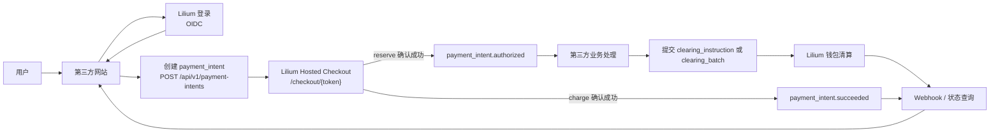
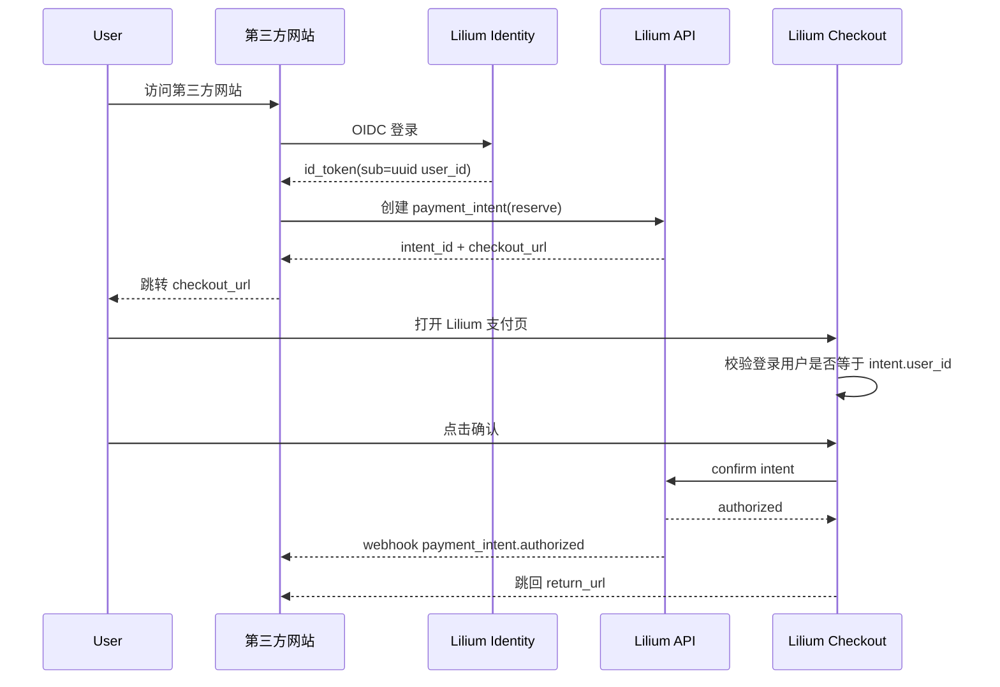
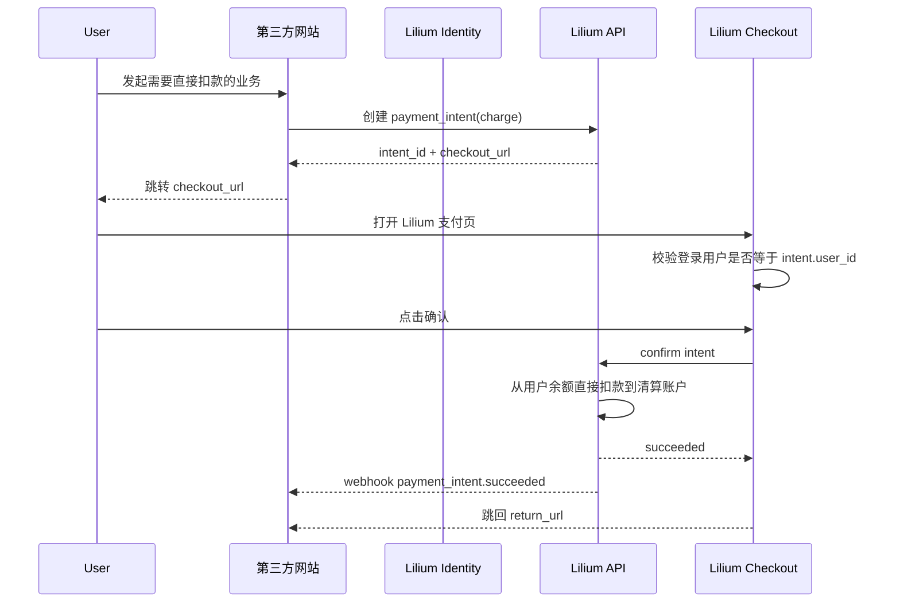
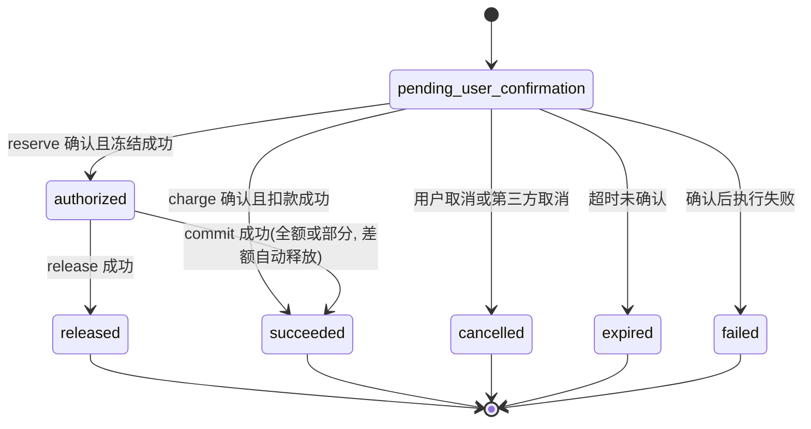
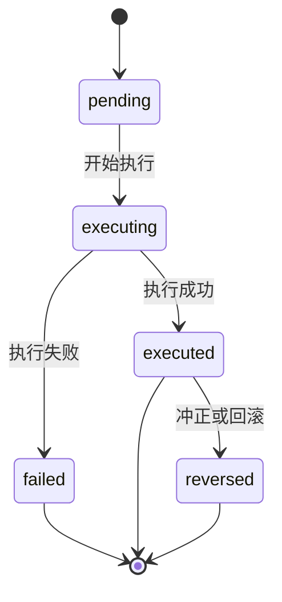
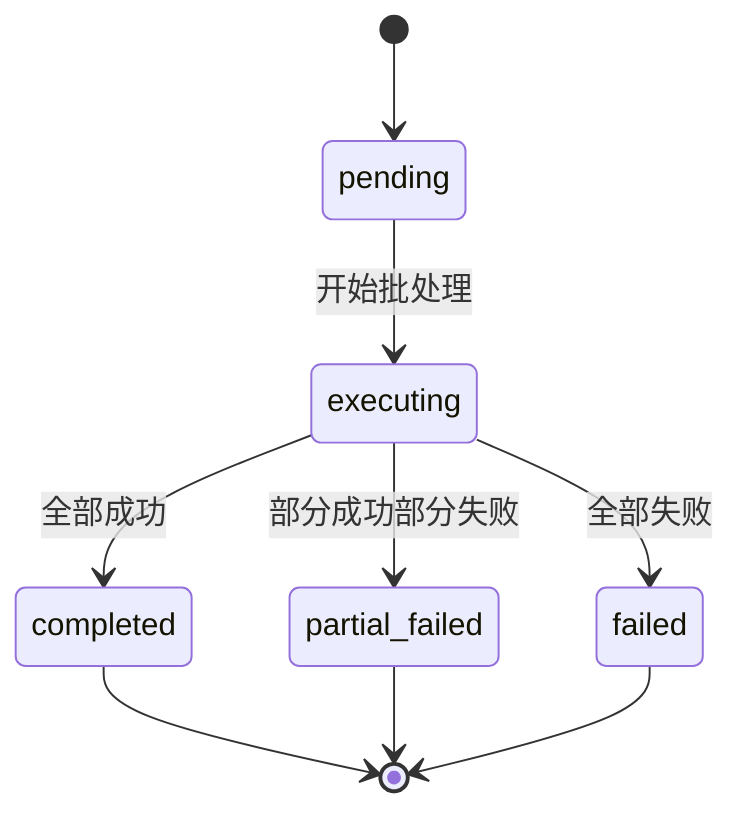

# Lilium 开放清算 API 接入规范 v1.1

适用对象：接入 Lilium 的第三方开发者  
文档状态：草案

## 目录

- [1. 文档说明](#overview)
- [2. 共享平台能力](#shared-platform)
- [3. 清算入口与会话边界](#clearing-entrypoints)
- [4. 核心对象](#objects)
- [5. 数据契约](#data-contract)
- [6. API 概览](#api-overview)
- [7. Payment Intent API](#payment-intent-api)
- [8. Clearing Instruction API](#clearing-instruction-api)
- [9. Clearing Batch API](#clearing-batch-api)
- [10. 列表查询 API](#list-api)
- [11. Hosted Checkout](#hosted-checkout)
- [12. 主流程](#flows)
- [13. 状态模型](#state-models)
- [14. Webhook](#webhooks)
- [15. 错误模型](#errors)
- [16. 幂等要求](#idempotency)
- [17. Rate Limit](#rate-limits)
- [18. 安全要求](#security)
- [19. 接入清单](#checklist)
- [20. 基金场景示例](#fund-examples)
- [21. OpenAPI 契约](#openapi)

<a id="overview"></a>
## 1. 文档说明

Lilium 提供面向第三方业务系统的游戏币清算能力。第三方可以：

- 使用 Lilium 身份体系识别用户
- 创建需要用户确认的支付意图
- 将用户跳转到 Lilium Hosted Checkout 完成确认
- 在业务结果明确后提交后台清算指令
- 通过 Webhook 或查询接口获取最终状态

本规范仅适用于游戏币场景，不涉及真实货币、银行卡或受监管支付体系。

典型场景：

- 基金申购
- 基金赎回到账
- 分红发放
- 保险资金池赔付
- 交易市场或拍卖结算

Lilium 负责：

- 用户认证
- 第三方后台鉴权
- Hosted Checkout
- 余额冻结、提交、退回、发放、扣减
- 状态查询、Webhook 和审计留痕

第三方负责：

- 业务产品本身
- 金额计算
- 业务订单与业务状态
- 申购成功或失败等业务结果判定
- 在业务处理完成后调用后续清算 API

边界：

- `user_id` 是业务标识，不是直接授权凭证
- 任何会冻结或扣减用户余额的动作，都必须由用户在 Lilium 页面确认
- 第三方不得绕过 Hosted Checkout 直接发起用户扣款或冻结
- Lilium 不计算基金净值、份额、收益、亏损或持仓
- Lilium 不提供官方 SDK，仅提供 OpenAPI 契约

<a id="endpoints"></a>
<a id="shared-platform"></a>
## 2. 共享平台能力

本规范只定义清算能力本身。平台级认证、统一入口、OIDC 与 `client_credentials` token 获取流程，统一见：

- [Lilium 平台认证与路由规范 v1.1](./lilium-platform-authentication.md)

接入清算能力前，第三方应先完成共享平台能力接入：

- 完成 OIDC 登录接入，获取稳定的 `user_id`
- 完成 OAuth2 `client_credentials` token 获取与 Bearer 认证接入
- 了解清算相关公开入口与认证方式

<a id="auth"></a>
<a id="clearing-entrypoints"></a>
## 3. 清算入口与会话边界

清算相关入口为：

- `https://lilium.kuma.homes/api/v1/payment-intents`
- `https://lilium.kuma.homes/api/v1/clearing-instructions`
- `https://lilium.kuma.homes/api/v1/clearing-batches`
- `https://lilium.kuma.homes/checkout/{checkout_token}`
- `https://lilium.kuma.homes/openapi.json`

认证边界：

- `/api/v1/*` 清算 API 使用共享平台认证文档定义的 `Bearer` token
- machine token 通过 `effective_account_user_id` 绑定到主账户或子账户，只能操作绑定账户对应的数据
- browser token 通过用户登录身份直接操作
- `checkout` 页面由用户浏览器直接访问，并要求用户在 Lilium 完成登录
- `checkout` 不使用第三方的 API 凭证鉴权
- `checkout` 页面必须基于当前登录用户校验 `intent.user_id`
- `checkout` confirm 不再要求 `intent.account_code == intent.partner_user_id`；confirm 依赖 persisted intent

Hosted Checkout 约束：

- 如果用户访问 `checkout` 时未登录，Lilium 应跳转到登录流程
- 登录成功后，Lilium 应回到原始 `checkout` 页面继续支付确认
- 浏览器跳转结果不是最终真相；第三方仍必须通过 Webhook 或查询接口确认最终状态

<a id="objects"></a>
## 4. 核心对象

### 4.1 `user_id`

Lilium 全局用户标识，用于所有用户相关请求与响应。

### 4.2 `partner`

每个 partner 是一个 Lilium 用户。partner 通过 API 凭证操作清算能力。

partner 核心身份字段：

- `user_id`（partner 身份，等于 Lilium 用户标识）

每个 partner 可以创建多组 API 凭证（多个 `client_id`），各自独立管理。  
每条 credential 至少包含：

- `client_id`
- `allowed_scopes`
- `webhook_url`

说明：

- `client_secret` 与 `webhook_secret` 属于凭证签发材料，只会在创建或轮换时返回
- 它们不是可公开读取的 partner 资源字段

### 4.3 `account_code`

`account_code` 标识清算对手账户。在主账户模式下等于 partner 的 `user_id`；在子账户模式下等于 machine token 绑定的子账户 `user_id`。

这意味着：

- 每个 partner 主账户有一个清算账户（`account_code` = 主账户 `user_id`）
- partner 主账户名下的子账户各有独立清算账户（`account_code` = 子账户 `user_id`）
- machine token 只能操作其绑定的 `effective_account_user_id` 对应的清算账户
- 第三方在 create 请求中可以不传 `account_code`，服务端自动补值为 token 的绑定账户
- 如果传入 `account_code`，必须等于 token 的 `effective_account_user_id`，否则返回 `INVALID_ACCOUNT_CODE`

详见 [5.2 `account_code` 兼容模式](#account-code-compat)。

### 4.4 `payment_intent`

需要用户确认的一笔支付意图。适用于用户授权场景。

### 4.5 `clearing_instruction`

单笔后台清算动作。适用于已获授权后的后续处理，或无需再次用户确认的发放类动作。

### 4.6 `clearing_batch`

一批后台清算动作的提交与执行结果汇总。

### 4.7 接入配置模型

每个 partner 需要维护一类配置：**接口凭证**。

接口凭证解决：

- 谁可以调用 API
- 可调用哪些 scope
- Webhook 如何签名和验签
- 具体请求归属到哪一组凭证

清算账户不需要单独配置——partner 的钱包及子账户钱包即为清算对手账户（`account_code` = 绑定账户 `user_id`）。

关系模型：

- 一个 `partner` 对应一个 Lilium 用户
- 一个 `partner` 可以创建一个或多个 `client`（多组 API 凭证）
- 一个 `partner` 有一个主清算账户（其自身钱包），名下子账户各有独立清算账户
- 每次 API 写操作都绑定到发起该请求的 `client_id`
- 由该操作产生的 webhook 使用该 `client_id` 对应的 webhook 配置投递
- machine token 通过 `effective_account_id` 绑定到主账户或某个子账户，token 只能操作绑定账户对应的清算账户

<a id="data-contract"></a>
## 5. 数据契约

除非另有说明，所有字符串字段均使用 UTF-8 编码，且不应包含前后空白。

### 5.1 字段与长度约束

| 字段 | 适用范围 | 类型 | 约束 | 说明 |
| --- | --- | --- | --- | --- |
| `user_id` | 所有用户相关请求/响应 | string | UUID，固定 36 字符 | 例如 `550e8400-e29b-41d4-a716-446655440000` |
| `partner_id` | Webhook envelope、列表查询 | string | UUID，固定 36 字符 | 等于 partner 的 `user_id` |
| `account_code` | `payment_intent` / `clearing_instruction` / `clearing_batch` | string | UUID，固定 36 字符，全局唯一；create 请求中可选 | 例如 `11111111-2222-4333-8444-555555555555`；不传时服务端自动补值为 token 绑定账户 |
| `intent_id` | `payment_intent` 响应、`clearing_instruction` 请求、`clearing_batch.items[]` | string | 1-64 字符 | Lilium 生成，例如 `pi_...` |
| `instruction_id` | `clearing_instruction` 响应 | string | 1-64 字符 | Lilium 生成，例如 `ci_...` |
| `batch_id` | `clearing_batch` 响应 | string | 1-64 字符 | Lilium 生成，例如 `cb_...` |
| `batch_item_id` | `clearing_batch` 明细响应 | string | 1-64 字符 | Lilium 生成的批次明细标识 |
| `partner_reference_id` | 单笔业务请求 | string | 1-128 字符 | 第三方业务侧唯一引用 |
| `batch_reference_id` | 批量业务请求 | string | 1-128 字符 | 第三方批次引用 |
| `asset_code` | 所有清算相关请求/响应 | string | 固定值 `dollars` | v1 当前唯一合法取值 |
| `amount` | 所有金额字段 | string | 正数字符串，符合 `DECIMAL(38,2)`，即最多 36 位整数 + 2 位小数 | 例如 `1000.00` |
| `title` | `payment_intent` | string | 1-64 字符 | Checkout 页展示标题 |
| `summary` | `payment_intent` | string | 1-200 字符 | Checkout 页展示说明 |
| `note` | `clearing_instruction` / `clearing_batch.items[]` | string | 0-200 字符 | 可选说明 |
| `reason` | `reverse` 请求 | string | 枚举值，1-64 字符 | 冲正原因代码 |
| `expires_in_seconds` | `payment_intent` 请求 | integer | 60-3600 | 支付意图有效期，单位秒 |
| `return_url` | `payment_intent` | string | HTTPS URL，最长 2048 字符 | 确认成功跳回地址 |
| `cancel_url` | `payment_intent` | string | HTTPS URL，最长 2048 字符 | 用户取消跳回地址 |
| `webhook_url` | partner 配置 | string | HTTPS URL，最长 2048 字符 | Webhook 接收地址 |
| `Authorization` | 所有 API 请求头 | string | `Bearer <token>` | OAuth2 access token |
| `Idempotency-Key` | 所有写接口请求头 | string | 1-128 字符 | 可使用 UUID 字符串 |

补充规则：

- `amount` 必须大于 `0`
- `amount` 统一使用字符串传输，禁止使用 JSON number
- `title`、`summary`、`note` 不应包含 HTML 或脚本片段
- `return_url`、`cancel_url`、`webhook_url` 必须是 `https://` 地址
- `partner_reference_id` 在同一个 partner 的同一种业务动作下应保持唯一
- `batch_reference_id` 在同一个 partner 下应保持唯一

### 5.2 `account_code` 兼容模式

<a id="account-code-compat"></a>

`account_code` 标识本次清算操作的对手账户。其最终持久化值始终等于当前 machine token 的 `effective_account_user_id`。

create 类接口的 `account_code` 字段规则：

- **不传 `account_code`**：服务端自动补值为 `effective_account_user_id`
- **传入 `account_code`**：必须严格等于 `effective_account_user_id`，否则返回 `INVALID_ACCOUNT_CODE`
- **持久化值**：无论是否传入，最终持久化的 `account_code` 恒等于 `effective_account_user_id`

read / list / cancel / reverse 类接口的账户可见范围：

- machine token 只能看到 `effective_account_user_id` 对应账户的数据
- 查询语义为：`partner_user_id = owner AND account_code = effective_account_user_id`
- 不存在 owner 级横向可见性——绑定子账户的 token 无法看到主账户或其他子账户的数据

约束：

- 类型：UUID 字符串
- 长度：固定 36 字符
- 每个 machine token 只能操作一个 `account_code` 对应的清算账户

### 5.3 `asset_code`

所有请求和响应都保留 `asset_code` 字段。

Lilium v1 中，`asset_code` 当前只有一个合法取值：

- `dollars`

### 5.4 `operation` 枚举约束

`payment_intents.operation` 的合法取值只有：

- `reserve`
- `charge`

`clearing_instructions.operation` 的合法取值只有：

- `commit`
- `release`
- `payout`

`clearing_batches.operation` 的合法取值只有：

- `commit`
- `release`
- `payout`

不支持的规则：

- `reserve` 和 `charge` 不能出现在 `clearing_instruction` 或 `clearing_batch`
- `commit`、`release`、`payout` 不能出现在 `payment_intent`

原因：

- `reserve` 和 `charge` 需要用户逐笔在 Hosted Checkout 中确认
- `commit`、`release`、`payout` 是后台清算动作，不应再次要求用户确认

### 5.5 `reserve` 的最终结算与部分清算规则

对 `operation = reserve` 的 `payment_intent`，Lilium 定义如下规则：

- `reserve` 成功后，用户资金进入冻结状态，对应 `payment_intent.status = authorized`
- 对同一 `payment_intent`，只允许一次最终结算
- 最终结算方式只能是：
  - 一次 `commit`
  - 或一次 `release`

#### `commit.amount` 规则

`commit.amount` 必须满足：

- `0 < commit.amount <= reserved_amount`

#### 部分清算

当 `commit.amount < reserved_amount` 时，视为部分清算。

Lilium 的处理规则是：

1. 提交 `commit.amount`
2. 自动释放剩余冻结金额 `reserved_amount - commit.amount`
3. 将该 `payment_intent` 置为最终成功状态

#### 不允许的行为

以下行为均不允许：

- 对同一 `payment_intent` 多次 `commit`
- 先 `commit` 再额外 `release`
- 多次部分 `commit` 累加到最终金额
- `commit.amount > reserved_amount`

#### `release` 规则

`release` 用于整笔取消尚未结算的冻结金额。

- 若未发生 `commit`，允许一次 `release`
- `release` 默认释放全部剩余冻结金额
- `release` 请求中不接受 `amount`
- 若 `release` 请求携带 `amount`，服务端应拒绝该请求并返回 `INVALID_FIELD`
- `release` 完成后，该 `payment_intent` 进入最终关闭状态

<a id="api-overview"></a>
## 6. API 概览

| API | 方法 | 用途 |
| --- | --- | --- |
| `/api/v1/payment-intents` | `POST` | 创建需要用户确认的支付意图 |
| `/api/v1/payment-intents/{intent_id}` | `GET` | 查询支付意图 |
| `/api/v1/payment-intents/{intent_id}/cancel` | `POST` | 取消未确认的支付意图 |
| `/api/v1/clearing-instructions` | `POST` | 创建单笔后台清算指令 |
| `/api/v1/clearing-instructions/{instruction_id}` | `GET` | 查询单笔后台清算指令 |
| `/api/v1/clearing-instructions/{instruction_id}/reverse` | `POST` | 对单笔已执行清算发起冲正 |
| `/api/v1/clearing-batches` | `POST` | 创建批量后台清算任务 |
| `/api/v1/clearing-batches/{batch_id}` | `GET` | 查询批量后台清算任务 |
| `/api/v1/clearing-batches/{batch_id}/items` | `GET` | 分页查询批量任务明细 |
| `/api/v1/payment-intents` | `GET` | 按条件查询支付意图列表 |
| `/api/v1/clearing-instructions` | `GET` | 按条件查询清算指令列表 |
| `/api/v1/clearing-batches` | `GET` | 按条件查询批量任务列表 |

钱包相关 API 见：

- [Lilium 钱包 API 接入规范 v1](./lilium-wallet-api-design.md)

说明：

- 所有 create 类接口的 `account_code` 字段为可选；不传时服务端自动补值为 token 绑定账户
- 所有 read / list / cancel / reverse 类接口按 token 绑定账户过滤，不提供 owner 级横向可见性

<a id="payment-intent-api"></a>
## 7. Payment Intent API

### 7.1 创建支付意图

`POST /api/v1/payment-intents`

`operation` 取值范围：

- `reserve`
- `charge`

语义：

- `reserve`：用户确认后仅冻结资金，后续仍需 `commit` 或 `release`
- `charge`：用户确认后直接从用户余额扣款到清算账户，不需要后续 `clearing_instruction`

`account_code` 兼容模式：

- `account_code` 为可选字段
- 不传时，服务端自动补值为 token 的 `effective_account_user_id`
- 传入时，必须等于 `effective_account_user_id`，否则返回 `INVALID_ACCOUNT_CODE`

请求示例（不传 `account_code`）：

```json
{
  "user_id": "550e8400-e29b-41d4-a716-446655440000",
  "operation": "reserve",
  "amount": "1000.00",
  "asset_code": "dollars",
  "title": "Alpha 基金申购",
  "summary": "冻结 1000.00 dollars 用于 Alpha 基金申购",
  "partner_reference_id": "sub_20260409_001",
  "return_url": "https://partner.example.com/pay/return",
  "cancel_url": "https://partner.example.com/pay/cancel",
  "expires_in_seconds": 900
}
```

请求示例（传入 `account_code`）：

```json
{
  "user_id": "550e8400-e29b-41d4-a716-446655440000",
  "operation": "reserve",
  "account_code": "11111111-2222-4333-8444-555555555555",
  "amount": "1000.00",
  "asset_code": "dollars",
  "title": "Alpha 基金申购",
  "summary": "冻结 1000.00 dollars 用于 Alpha 基金申购",
  "partner_reference_id": "sub_20260409_001",
  "return_url": "https://partner.example.com/pay/return",
  "cancel_url": "https://partner.example.com/pay/cancel",
  "expires_in_seconds": 900
}
```

响应示例：

```json
{
  "intent_id": "pi_001",
  "status": "pending_user_confirmation",
  "checkout_url": "https://lilium.kuma.homes/checkout/ck_abc123",
  "expires_at": "2026-04-09T12:00:00Z"
}
```

`charge` 示例：

```json
{
  "user_id": "550e8400-e29b-41d4-a716-446655440000",
  "operation": "charge",
  "amount": "88.00",
  "asset_code": "dollars",
  "title": "基金申购手续费",
  "summary": "支付 88.00 dollars 到指定清算账户",
  "partner_reference_id": "charge_20260409_001",
  "return_url": "https://partner.example.com/pay/return",
  "cancel_url": "https://partner.example.com/pay/cancel",
  "expires_in_seconds": 900
}
```

### 7.2 查询支付意图

`GET /api/v1/payment-intents/{intent_id}`

响应示例：

```json
{
  "intent_id": "pi_001",
  "status": "authorized",
  "user_id": "550e8400-e29b-41d4-a716-446655440000",
  "operation": "reserve",
  "account_code": "11111111-2222-4333-8444-555555555555",
  "amount": "1000.00",
  "asset_code": "dollars",
  "partner_reference_id": "sub_20260409_001",
  "authorized_at": "2026-04-09T12:01:02Z"
}
```

### 7.3 取消支付意图

`POST /api/v1/payment-intents/{intent_id}/cancel`

仅允许在 `pending_user_confirmation` 状态取消。

<a id="clearing-instruction-api"></a>
## 8. Clearing Instruction API

### 8.1 创建清算指令

`POST /api/v1/clearing-instructions`

`operation` 取值范围：

- `commit`
- `release`
- `payout`

`account_code` 兼容模式：

- `account_code` 为可选字段
- 不传时，服务端自动补值为 token 的 `effective_account_user_id`
- 传入时，必须等于 `effective_account_user_id`，否则返回 `INVALID_ACCOUNT_CODE`

字段规则：

- 当 `operation = commit` 或 `operation = release` 时，`intent_id` 必填
- 当 `operation = payout` 时，`intent_id` 不填
- 当 `operation = release` 时，`amount` 不填
- 当 `operation = commit` 或 `operation = payout` 时，`amount` 必填

部分清算规则：

- `commit.amount < reserved_amount` 时，系统自动释放差额
- 同一 `payment_intent` 不允许多次 `commit`

申购成功示例：

```json
{
  "operation": "commit",
  "intent_id": "pi_001",
  "user_id": "550e8400-e29b-41d4-a716-446655440000",
  "amount": "800.00",
  "asset_code": "dollars",
  "partner_reference_id": "sub_20260409_001",
  "note": "申购部分成交"
}
```

申购失败示例：

```json
{
  "operation": "release",
  "intent_id": "pi_001",
  "user_id": "550e8400-e29b-41d4-a716-446655440000",
  "asset_code": "dollars",
  "partner_reference_id": "sub_20260409_001",
  "note": "申购失败退回"
}
```

分红发放示例：

```json
{
  "operation": "payout",
  "user_id": "550e8400-e29b-41d4-a716-446655440000",
  "amount": "85.25",
  "asset_code": "dollars",
  "partner_reference_id": "dividend_20260409_001",
  "note": "分红发放"
}
```

响应示例：

```json
{
  "instruction_id": "ci_001",
  "status": "executed",
  "operation": "payout",
  "user_id": "550e8400-e29b-41d4-a716-446655440000",
  "account_code": "11111111-2222-4333-8444-555555555555",
  "amount": "85.25",
  "asset_code": "dollars",
  "executed_at": "2026-04-09T12:10:00Z"
}
```

### 8.2 查询清算指令

`GET /api/v1/clearing-instructions/{instruction_id}`

### 8.3 冲正清算指令

`POST /api/v1/clearing-instructions/{instruction_id}/reverse`

该接口用于对已执行的单笔清算发起冲正。

限制：

- 仅允许对状态为 `executed` 的指令发起
- 仅以下 `operation` 支持冲正：
  - `commit`
  - `payout`
- 以下 `operation` 不支持冲正：
  - `release`
- 冲正是否成功取决于当前余额条件和业务规则

请求示例：

```json
{
  "reason": "manual_correction",
  "partner_reference_id": "reverse_20260409_001",
  "note": "人工冲正"
}
```

`reason` 取值范围：

- `manual_correction`
- `duplicate_execution`
- `downstream_reject`
- `operational_recovery`

响应示例：

```json
{
  "instruction_id": "ci_001",
  "status": "reversed",
  "reverse_instruction_id": "ci_002",
  "reversed_at": "2026-04-09T12:30:00Z"
}
```

<a id="clearing-batch-api"></a>
## 9. Clearing Batch API

### 9.1 创建批量清算任务

`POST /api/v1/clearing-batches`

批量清算仅适用于无需再次用户确认的后台动作。

`operation` 取值范围：

- `commit`
- `release`
- `payout`

`account_code` 兼容模式：

- `account_code` 为可选字段
- 不传时，服务端自动补值为 token 的 `effective_account_user_id`
- 传入时，必须等于 `effective_account_user_id`，否则返回 `INVALID_ACCOUNT_CODE`

请求示例（不传 `account_code`）：

```json
{
  "operation": "payout",
  "asset_code": "dollars",
  "batch_reference_id": "dividend_batch_20260409_001",
  "items": [
    {
      "user_id": "550e8400-e29b-41d4-a716-446655440000",
      "amount": "85.25",
      "partner_reference_id": "dividend_20260409_001",
      "note": "分红发放"
    },
    {
      "user_id": "6ba7b810-9dad-11d1-80b4-00c04fd430c8",
      "amount": "120.00",
      "partner_reference_id": "dividend_20260409_002",
      "note": "分红发放"
    }
  ]
}
```

如果 `operation = commit` 或 `operation = release`，则每个 `items[]` 元素必须额外包含：

- `intent_id`

如果 `operation = release`，则每个 `items[]` 元素不接受 `amount` 字段。

示例：

```json
{
  "operation": "commit",
  "asset_code": "dollars",
  "batch_reference_id": "subscription_commit_batch_20260409_001",
  "items": [
    {
      "intent_id": "pi_001",
      "user_id": "550e8400-e29b-41d4-a716-446655440000",
      "amount": "800.00",
      "partner_reference_id": "sub_20260409_001",
      "note": "申购部分成交"
    }
  ]
}
```

`release` 示例：

```json
{
  "operation": "release",
  "asset_code": "dollars",
  "batch_reference_id": "subscription_release_batch_20260409_001",
  "items": [
    {
      "intent_id": "pi_001",
      "user_id": "550e8400-e29b-41d4-a716-446655440000",
      "partner_reference_id": "sub_20260409_001",
      "note": "申购失败退回"
    }
  ]
}
```

响应示例：

```json
{
  "batch_id": "cb_001",
  "status": "pending",
  "operation": "payout",
  "account_code": "11111111-2222-4333-8444-555555555555",
  "asset_code": "dollars",
  "item_count": 2,
  "success_count": 0,
  "failed_count": 0,
  "created_at": "2026-04-09T12:15:00Z"
}
```

### 9.2 查询批量清算任务

`GET /api/v1/clearing-batches/{batch_id}`

该接口返回批量任务摘要，不返回完整明细列表。

响应中至少包含：

- 批次状态
- 总条数
- 成功条数
- 失败条数
- `has_more_failed_items`

响应示例：

```json
{
  "batch_id": "cb_001",
  "status": "partial_failed",
  "operation": "payout",
  "account_code": "11111111-2222-4333-8444-555555555555",
  "asset_code": "dollars",
  "item_count": 200,
  "success_count": 180,
  "failed_count": 20,
  "has_more_failed_items": false,
  "created_at": "2026-04-09T12:15:00Z",
  "completed_at": "2026-04-09T12:18:00Z"
}
```

### 9.3 查询批量清算任务明细

`GET /api/v1/clearing-batches/{batch_id}/items`

该接口用于分页查询批量任务明细，支持全部明细或仅失败明细。

查询参数：

- `status`
  可选值：`all`、`failed`
- `cursor`
  可选，分页游标
- `limit`
  可选，默认 `100`，最大 `500`

响应中至少包含：

- `items`
- `next_cursor`
- `has_more`

单个明细建议至少包含：

- `batch_item_id`
- `user_id`
- `intent_id`
- `amount`
- `status`
- `partner_reference_id`
- `error_code`
- `error_message`

单条明细的 `status` 取值范围：

- `pending`
- `executed`
- `failed`

批量请求约束：

- `items` 数组最大长度为 `1000`
- 超过上限时，服务端应返回 `INVALID_BATCH_SIZE`

<a id="list-api"></a>
## 10. 列表查询 API

为支持对账，Lilium 提供以下列表接口：

- `GET /api/v1/payment-intents`
- `GET /api/v1/clearing-instructions`
- `GET /api/v1/clearing-batches`

### 10.1 查询参数

`GET /api/v1/payment-intents` 支持：

- `partner_reference_id`
- `status`
- `created_from`
- `created_to`
- `cursor`
- `limit`

`GET /api/v1/clearing-instructions` 支持：

- `partner_reference_id`
- `status`
- `created_from`
- `created_to`
- `cursor`
- `limit`

`GET /api/v1/clearing-batches` 支持：

- `batch_reference_id`
- `status`
- `created_from`
- `created_to`
- `cursor`
- `limit`

### 10.2 响应格式

所有列表接口统一返回分页结构：

```json
{
  "items": [],
  "next_cursor": "cursor_123",
  "has_more": false
}
```

示例：

```json
{
  "items": [
    {
      "instruction_id": "ci_001",
      "status": "executed",
      "operation": "payout",
      "partner_reference_id": "dividend_20260409_001",
      "created_at": "2026-04-09T12:10:00Z"
    }
  ],
  "next_cursor": null,
  "has_more": false
}
```

### 10.3 限制

- `limit` 默认值为 `100`
- `limit` 最大值为 `500`

<a id="hosted-checkout"></a>
## 11. Hosted Checkout

Hosted Checkout 是唯一允许终端用户对 `reserve` 和 `charge` 做授权确认的页面。

行为规则：

- 若用户未登录 Lilium，则跳转到现有前端登录流程
- 登录成功后返回原始 `checkout` 页面
- 若当前登录用户与 `intent.user_id` 不一致，则支付失败
- 页面展示标题、金额、清算账户、说明文案
- 用户只需点击一次确认
- 确认完成后，Lilium 跳转回第三方提供的 `return_url`

浏览器跳转结果不是最终真相。第三方必须通过以下任一方式确认最终状态：

- 接收 Webhook
- 查询 `GET /api/v1/payment-intents/{intent_id}`
- 查询 `GET /api/v1/clearing-instructions/{instruction_id}`
- 查询 `GET /api/v1/clearing-batches/{batch_id}`

<a id="flows"></a>
## 12. 主流程

### 12.1 总体流程图



### 12.2 申购冻结流程



### 12.3 申购成功流程

1. 用户完成 `reserve` 确认
2. Lilium 冻结用户余额
3. 第三方处理基金申购逻辑
4. 第三方调用 `commit`
5. 若 `commit.amount < reserved_amount`，Lilium 自动释放差额
6. `payment_intent` 进入最终成功状态

### 12.4 申购失败流程

1. 用户完成 `reserve` 确认
2. Lilium 冻结用户余额
3. 第三方判定申购失败
4. 第三方调用 `release`
5. Lilium 将已冻结金额退回用户

### 12.5 赎回或分红发放流程

1. 第三方计算应发放金额
2. 第三方调用 `payout` 或批量 `payout`
3. Lilium 从对应清算账户向用户发放余额

### 12.6 直接扣款 `charge` 流程

`charge` 是一步完成的支付意图。

规则：

- 用户在 Hosted Checkout 确认后，Lilium 立即执行扣款
- 资金直接从用户余额进入指定清算账户
- 不需要后续 `clearing_instruction`
- 成功后 `payment_intent` 直接进入 `succeeded`



<a id="state-models"></a>
## 13. 状态模型

### 13.1 `payment_intent`

状态枚举：

- `pending_user_confirmation`
- `authorized`
- `released`
- `succeeded`
- `cancelled`
- `expired`
- `failed`

`succeeded` 的语义取决于 `operation`：

- `operation = charge`：表示用户确认后直接扣款成功
- `operation = reserve`：表示该预授权已通过 `commit` 完成最终结算；如果存在差额，差额已自动释放

`failed` 是终态。

恢复规则：

- `payment_intent` 进入 `failed` 后，第三方应在修复失败原因后创建新的 `payment_intent`
- 不应对同一个已失败 `payment_intent` 重复发起确认

状态机：



### 13.2 `clearing_instruction`

状态枚举：

- `pending`
- `executing`
- `executed`
- `failed`
- `reversed`

状态机：



### 13.3 `clearing_batch`

状态枚举：

- `pending`
- `executing`
- `completed`
- `partial_failed`
- `failed`

状态机：



<a id="webhooks"></a>
## 14. Webhook

Lilium 会在关键状态变化时向第三方发送 Webhook。

### 14.1 请求头

- `X-Lilium-Event-Id`
- `X-Lilium-Timestamp`
- `X-Lilium-Signature`
- `Content-Type: application/json`

字段规则：

- `X-Lilium-Event-Id`
  事件唯一标识；第三方应使用它做幂等去重
- `X-Lilium-Timestamp`
  UTC 时间戳，格式为 RFC3339
- `X-Lilium-Signature`
  `HMAC-SHA256` 结果的十六进制小写编码

### 14.2 签名规则

Lilium 使用第三方的 `webhook_secret` 对以下字符串做 `HMAC-SHA256`：

```text
{timestamp}.{raw_body}
```

计算方式说明：

- 取请求头 `X-Lilium-Timestamp` 的原始值
- 追加一个字面量半角句号 `.`
- 再追加原始请求体 `raw_body`
- 将三者按顺序拼接后进行 HMAC-SHA256 计算

验签建议：

- 第三方应校验 `X-Lilium-Timestamp` 与本地时间偏差不超过 `5` 分钟
- 第三方应按 `X-Lilium-Event-Id` 做事件去重，防止重放或重复投递
- 只要签名验证失败，就应拒绝该 webhook 并返回非 `2xx`

### 14.3 投递语义

- 非 `2xx` 响应视为失败
- Lilium 会对失败投递重试
- 第三方必须保证 Webhook 处理逻辑幂等
- 浏览器跳转不等同于 Webhook 成功投递

重试策略：

- 最大重试次数：`8`
- 重试窗口：`24` 小时
- 退避策略：指数退避
- 超过重试窗口后，事件进入死信状态，不再自动重试

### 14.4 Webhook payload 统一结构

所有 Webhook payload 都使用统一 envelope：

```json
{
  "id": "evt_001",
  "type": "payment_intent.authorized",
  "api_version": "v1",
  "created_at": "2026-04-09T12:01:02Z",
  "partner_id": "550e8400-e29b-41d4-a716-446655440000",
  "data": {
    "object": "payment_intent",
    "id": "pi_001",
    "attributes": {}
  }
}
```

字段说明：

- `id`
  Webhook 事件唯一标识
- `type`
  事件类型
- `api_version`
  事件对应的契约版本
- `created_at`
  事件产生时间，ISO 8601 UTC 时间戳
- `partner_id`
  事件归属的 partner，值等于 partner 的 `user_id`
- `data.object`
  资源类型，取值之一：`payment_intent`、`clearing_instruction`、`clearing_batch`
- `data.id`
  资源主标识；这是事件中该资源的规范引用字段
- `data.attributes`
  资源快照；若其中包含 `intent_id`、`instruction_id` 或 `batch_id`，这些字段与 `data.id` 表示同一资源标识，属于资源快照中的冗余镜像

### 14.5 事件类型

`payment_intent` 事件：

- `payment_intent.created`
- `payment_intent.authorized`
- `payment_intent.released`
- `payment_intent.succeeded`
- `payment_intent.cancelled`
- `payment_intent.expired`
- `payment_intent.failed`

`clearing_instruction` 事件：

- `clearing_instruction.executed`
- `clearing_instruction.failed`
- `clearing_instruction.reversed`

`clearing_batch` 事件：

- `clearing_batch.completed`
- `clearing_batch.partial_failed`
- `clearing_batch.failed`

### 14.6 `payment_intent` 事件负载

`data.object = "payment_intent"` 时，`data.attributes` 至少包含：

- `intent_id`
- `user_id`
- `operation`
- `account_code`
- `amount`
- `asset_code`
- `status`
- `partner_reference_id`

示例：

```json
{
  "id": "evt_001",
  "type": "payment_intent.authorized",
  "api_version": "v1",
  "created_at": "2026-04-09T12:01:02Z",
  "partner_id": "550e8400-e29b-41d4-a716-446655440000",
  "data": {
    "object": "payment_intent",
    "id": "pi_001",
    "attributes": {
      "intent_id": "pi_001",
      "user_id": "550e8400-e29b-41d4-a716-446655440000",
      "operation": "reserve",
      "account_code": "11111111-2222-4333-8444-555555555555",
      "amount": "1000.00",
      "asset_code": "dollars",
      "status": "authorized",
      "partner_reference_id": "sub_20260409_001"
    }
  }
}
```

### 14.7 `clearing_instruction` 事件负载

`data.object = "clearing_instruction"` 时，`data.attributes` 至少包含：

- `instruction_id`
- `user_id`
- `operation`
- `account_code`
- `amount`
- `asset_code`
- `status`
- `partner_reference_id`

其中：

- 当 `operation = commit` 或 `operation = release` 时，`intent_id` 必须存在
- 当 `operation = payout` 时，`intent_id` 不存在

### 14.8 `clearing_batch` 事件负载

`data.object = "clearing_batch"` 时，`data.attributes` 至少包含：

- `batch_id`
- `operation`
- `account_code`
- `asset_code`
- `status`
- `item_count`
- `success_count`
- `failed_count`
- `batch_reference_id`

如批量任务存在失败项，`data.attributes.failed_items` 应返回失败明细数组。每个失败项至少包含：

- `user_id`
- `partner_reference_id`
- `error_code`
- `error_message`

当失败项数量较大时，Webhook 只返回摘要字段，不返回完整 `failed_items`。详细失败明细应通过 `GET /api/v1/clearing-batches/{batch_id}/items?status=failed` 分页查询。

裁剪阈值：

- `failed_count > 100`
- 或 `failed_items` 序列化后体积预计超过 `256 KB`

当触发裁剪时，Webhook 只返回：

- `failed_count`
- `has_more_failed_items = true`

示例：

```json
{
  "id": "evt_101",
  "type": "clearing_batch.partial_failed",
  "api_version": "v1",
  "created_at": "2026-04-09T12:20:00Z",
  "partner_id": "550e8400-e29b-41d4-a716-446655440000",
  "data": {
    "object": "clearing_batch",
    "id": "cb_001",
    "attributes": {
      "batch_id": "cb_001",
      "operation": "payout",
      "account_code": "11111111-2222-4333-8444-555555555555",
      "asset_code": "dollars",
      "status": "partial_failed",
      "item_count": 2,
      "success_count": 1,
      "failed_count": 1,
      "batch_reference_id": "dividend_batch_20260409_001",
      "has_more_failed_items": true
    }
  }
}
```

<a id="errors"></a>
## 15. 错误模型

错误响应统一格式：

```json
{
  "error": {
    "code": "USER_BALANCE_INSUFFICIENT",
    "message": "wallet balance insufficient",
    "retryable": false
  },
  "request_id": "req_001"
}
```

常见错误码：

- `UNAUTHORIZED_PARTNER`
- `INVALID_SCOPE`
- `INVALID_USER_ID`
- `INVALID_ACCOUNT_CODE`
- `INVALID_OPERATION`
- `INTENT_NOT_CONFIRMABLE`
- `INTENT_EXPIRED`
- `USER_BALANCE_INSUFFICIENT`
- `INSUFFICIENT_ESCROW`
- `PARTNER_BALANCE_INSUFFICIENT`
- `IDEMPOTENCY_CONFLICT`
- `WEBHOOK_SIGNATURE_INVALID`
- `INVALID_BATCH_SIZE`
- `INVALID_FIELD`
- `RATE_LIMIT_EXCEEDED`
- `MISSING_IDEMPOTENCY_KEY`
- `RECIPIENT_NOT_FOUND`
- `INVALID_RECIPIENT`
- `SELF_TRANSFER`
- `INSUFFICIENT_BALANCE`
- `INVALID_AMOUNT`

钱包相关错误码说明见 [Lilium 钱包 API 接入规范 v1](./lilium-wallet-api-design.md)。

<a id="idempotency"></a>
## 16. 幂等要求

所有写接口都必须带 `Idempotency-Key`。

适用接口：

- `POST /api/v1/payment-intents`
- `POST /api/v1/payment-intents/{intent_id}/cancel`
- `POST /api/v1/clearing-instructions`
- `POST /api/v1/clearing-instructions/{instruction_id}/reverse`
- `POST /api/v1/clearing-batches`

规则：

- 同一个 partner client 对同一写接口使用相同 `Idempotency-Key` 时，服务端必须返回同一逻辑结果
- 第三方应将 `partner_reference_id` 或 `batch_reference_id` 与 `Idempotency-Key` 绑定保存
- 服务端保证相同 `Idempotency-Key` 的结果在 `24` 小时内保持一致

<a id="rate-limits"></a>
## 17. Rate Limit

Lilium 对 partner API 施加默认频率限制。

默认限制：

- 写接口：每个 `partner` 每分钟 `60` 次
- 读接口：每个 `partner` 每分钟 `300` 次

如 partner 需要更高限额，应单独申请。

<a id="security"></a>
## 18. 安全要求

除共享平台认证文档中的通用安全要求外，清算能力额外要求：

- 对所有 Webhook 做签名校验
- 不把 `user_id` 当作直接授权凭证
- 不绕过 Hosted Checkout 直接对用户做冻结或扣款

<a id="checklist"></a>
## 19. 接入清单

- 完成平台认证接入（见 [Lilium 平台认证与路由规范 v1](./lilium-platform-authentication.md)）
- 持久化保存 Lilium `user_id`
- 实现创建 `payment_intent`
- 完成跳转 Hosted Checkout
- 接收并处理 Webhook
- 在业务完成后调用 `commit`、`release`、`payout` 或批量清算 API
- 为所有写接口实现幂等
- 为所有业务订单保存 `partner_reference_id`

<a id="fund-examples"></a>
## 20. 基金场景示例

### 20.1 基金申购

1. 用户登录第三方网站
2. 第三方获取 Lilium `user_id`
3. 第三方调用 `POST /api/v1/payment-intents`，`operation=reserve`
4. 用户跳转 Hosted Checkout 确认冻结
5. 基金业务处理完成
6. 成功时调用 `commit`
7. 失败时调用 `release`

### 20.2 基金分红

1. 第三方计算单笔或批量分红金额
2. 单笔发放调用 `payout`
3. 批量发放调用 `POST /api/v1/clearing-batches`，`operation=payout`

### 20.3 基金赎回到账

1. 第三方计算赎回到账金额
2. 调用 `payout`
3. Lilium 从指定清算账户向用户发放余额

<a id="openapi"></a>
## 21. OpenAPI 契约

Lilium 提供完整的 OpenAPI 定义文档，作为对外接口契约。

OpenAPI 是第三方集成时的主要参考来源。第三方可以基于该文档：

- 生成客户端代码
- 校验请求和响应结构
- 构建自动化测试
- 对接错误码和状态模型

Markdown 规范文档与 OpenAPI 文档必须保持一致。字段长度、枚举、域名、事件类型和 Webhook 结构以对外发布的 OpenAPI 与本规范共同定义。

## 修订历史

- `2026-04-09`: 初始清算 API 规范成稿。
- `2026-04-09`: 认证方案切换为 OAuth2 `client_credentials` + Bearer token，统一单域名与 `/api/*` 路由。
- `2026-04-09`: 将平台级认证与路由说明拆分为共享文档，本规范收敛为清算专题文档。
- `2026-04-12`: v1.1 — `account_code` 改为 create 请求可选字段，服务端自动补值为 token 绑定账户；新增 effective-account 语义，machine token 按绑定账户过滤数据；checkout confirm 不再要求 `account_code == partner_user_id`；新增钱包相关错误码；引用钱包 API 文档。
